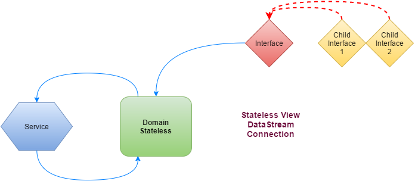
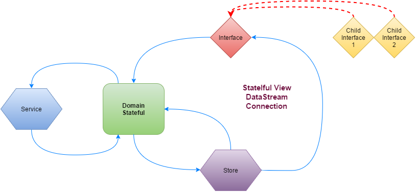
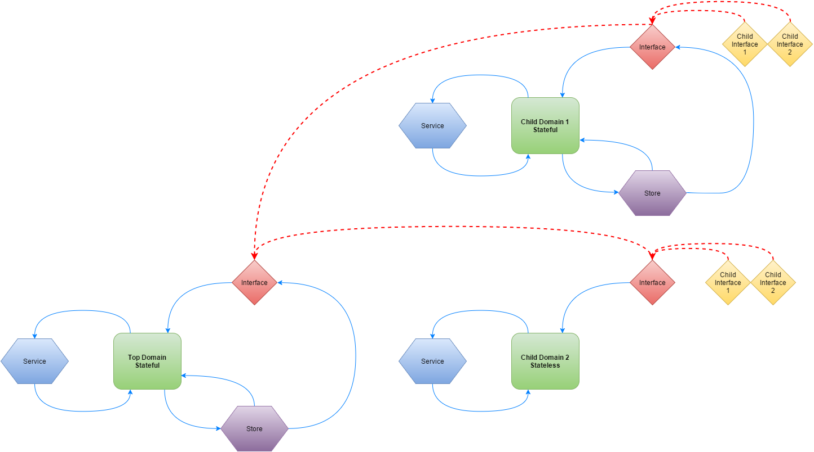
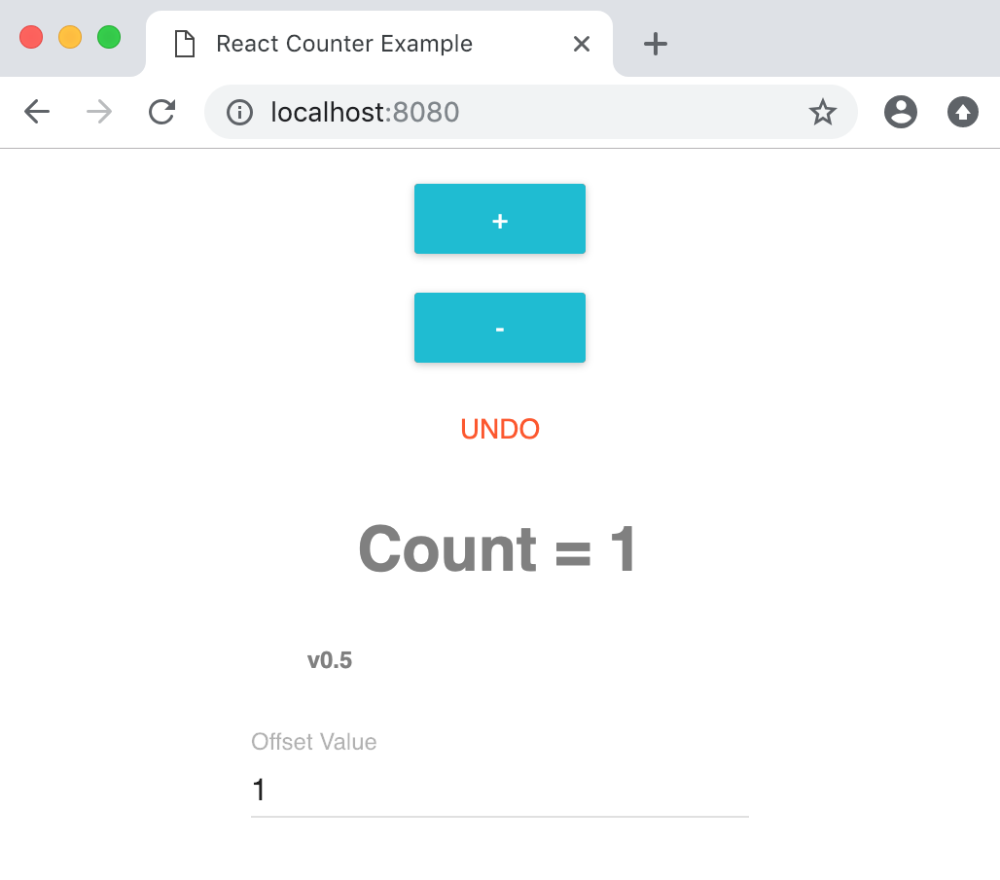
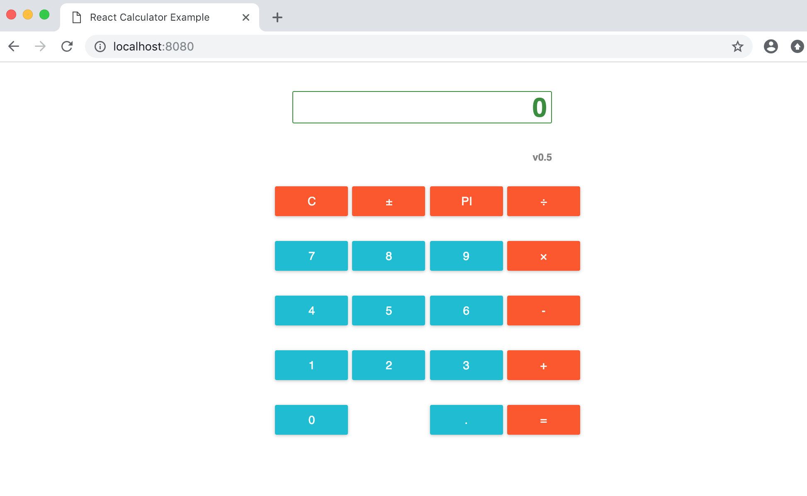

# [Hyperflow](https://github.com/tuantle/hyperflow)

### A javascript state flow and mutation management toolkit & library for developing universal app.

* * *

## Overview

Hyperflow was designed to provide a predictable and yet flexible methods of state management and complex data flow when developing modern javascript apps (web client, native, or server).

Hyperflow was build upon the reactive extension library [RxJS](https://github.com/reactivex/rxjs).

 that powers the domain layer's event-based communication using observable stream.

Hyperflow is a set of tools and library for universal app development that uses many fundamental software development concepts to streamline app development for various platforms. The core concepts of Hyperflow are: reactive uni-directional data flow handling ( inspired by Flux and Cycle.js), flat design using factory and composite pattern, and immutable and persistent app state. Hyperflow was designed to help developers organize and partition the apps into specific business domains, which is the last core concept of Hyperflow.

### Reactive Uni-directional Data Flow & App Business Logic Partitioning

In Hyperflow architecture, the data flow of the app is strictly uni-directional and complex app business logic is partition into what are called "domains". In each domain, the business logic would handle a specific app feature and will have a localized uni-directional data flow for its state.
The simpleness domain is a stateless one. Below is a data flow diagram of a stateless domain.

    

    

    

* * *

-   [Client (ReactJS & Webpack) Examples](#client-examples)
-   [Native (React Native iOS) Examples](#native-examples)
-   [Server (KoaJS) Examples](#server-examples)
-   [Installation](#installation)
-   [Documentation (WIP)](#documentation)
-   [Change Log](#change-log)
-   [MIT License](#license)

## Web Client Examples

#### Setup Webpack & Babel

To run web client examples, a module bundler and task runner is required and Webpack is a great tool for this. Webpack is a simple to setup and is very popular. It is adopted through out ReactJS community with plenty of supports from the community for any problem you might have with problems related to it.

So first install the following webpack packages:

-   **webpack** - the main webpack plugin as an engine for its dependents.
-   **webpack-cli** - webpack commands through CLI like starting dev server, creating production build, etc.
-   **webpack-dev-server** - a minimal server for client-side development & debugging.

    npm install --save-dev webpack webpack-cli webpack-dev-server

Since hyperflow and ReactJS need the latest babel to compile javascript, the following packages and plugins are required:

-   **@babel/core**
-   **@babel/preset-env**
-   **@babel/preset-reac**
-   **babel-loader**
-   **css-loader**
-   **style-loader**
-   **@babel/plugin-proposal-class-properties**
-   **@babel/plugin-proposal-object-rest-spread**
-   **@babel/plugin-syntax-dynamic-import**
-   **@babel/plugin-transform-strict-mode**

#### Counter

    

#### Calculator

    

## Hello World Server

(coming soon...)

* * *

## Installation

-   To install the stable version using [npm](https://www.npmjs.com/) package manager.

    npm install --save hyperflow

## Documentations

(coming soon...)

## Change Log

-   Link to [change log](https://github.com/tuantle/hyperflow/tree/master/CHANGELOG.md)

## License

Hyperflow is [MIT licensed](./LICENSE).
